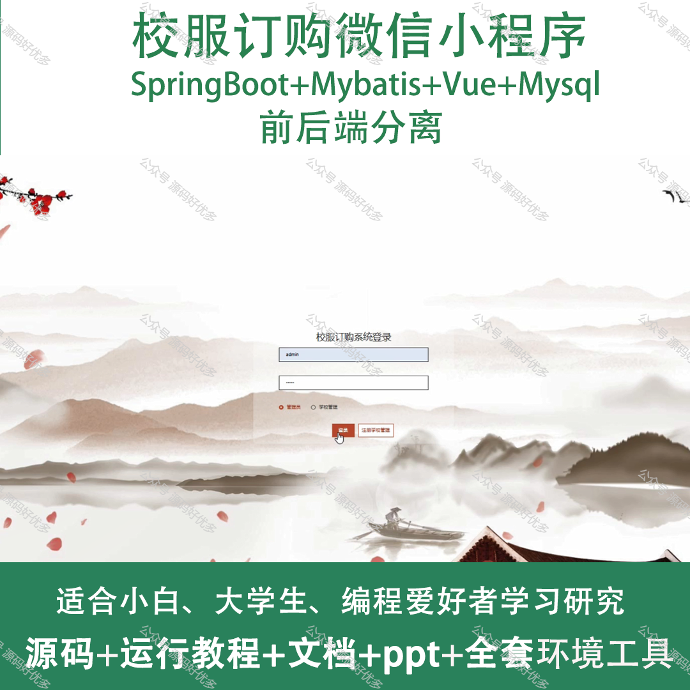
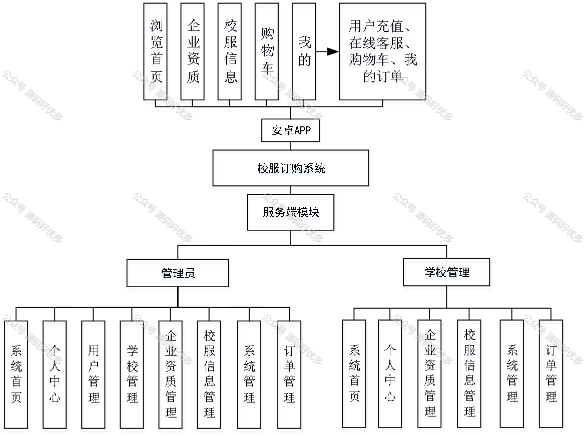
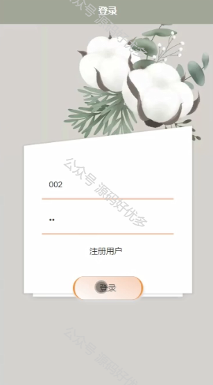
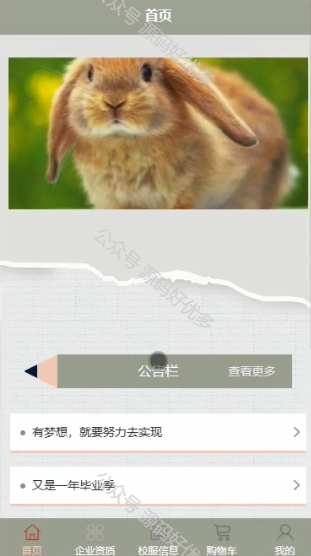
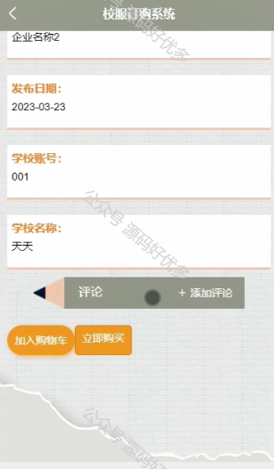
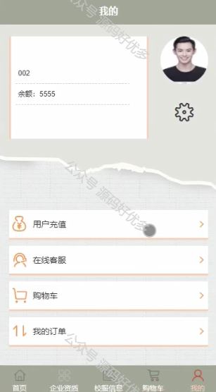
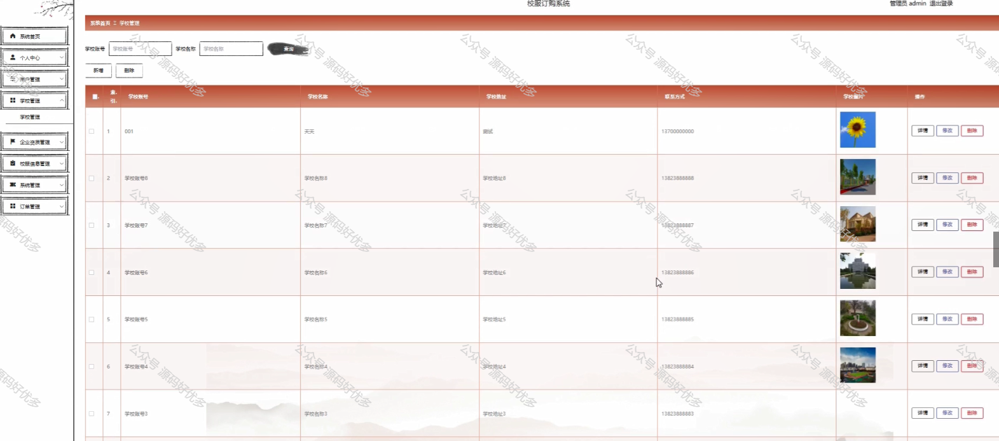
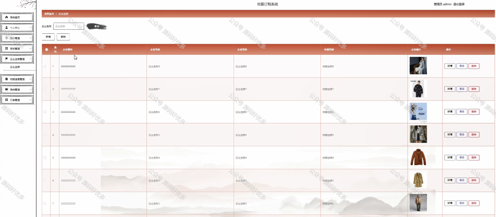
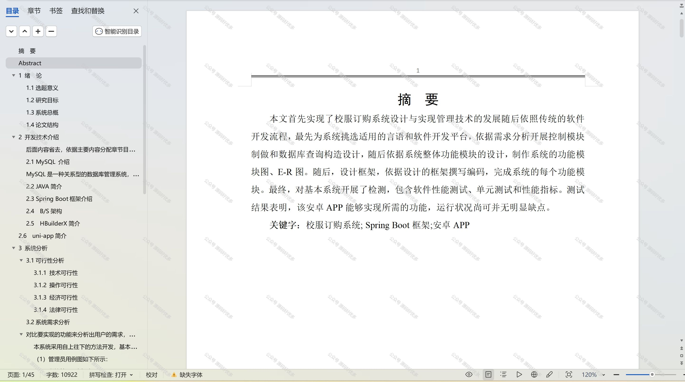

 
## 查看主页获取源码

> **作者介绍**： **✌**全网粉丝10W+本平台特邀作者、博客专家、CSDN新星计划导师、java领域优质创作者,博客之星、掘金/华为云/阿里云/InfoQ等平台优质作者、专注于项目实战 **✌**

  

### 一、作品包含

源码+数据库+设计文档万字+PPT+全套环境和工具资源+部署教程

### 二、项目技术

前端技术：Html、Css、Js、Vue、Element-ui

数据库：MySQL

后端技术：Java、Spring Boot、MyBatis

  

### 三、运行环境

开发工具：IDEA/eclipse + 微信开发者工具

数据库：MySQL5.7

数据库管理工具：Navicat10以上版本

环境配置软件： JDK1.8+Maven3.6.3

前端Nodejs：14

### 四、项目介绍
项目编号：mpweixinA008

校服订购微信小程序是一款专为学校和学生设计的便捷在线订购平台，它提供了校服的展示。通过这个小程序，可以轻松挑选合适的校服，简化了传统的订购流程，提高了购买效率，同时也方便学校对校服的统一管理和分发。

前台学生功能：浏览首页、企业资质、校服信息、购物车、用户充值、在线客服、购物车、我的订单。

后台分为管理员和学校
管理员的功能：系统首页、个人中心、用户管理、学校管理、企业资质管理、校服信息管理、系统管理和订单管理。
学校的功能：系统首页、个人中心、企业资质管理、校服信息管理、系统管理、订单管理。

### 五、运行截图

  
